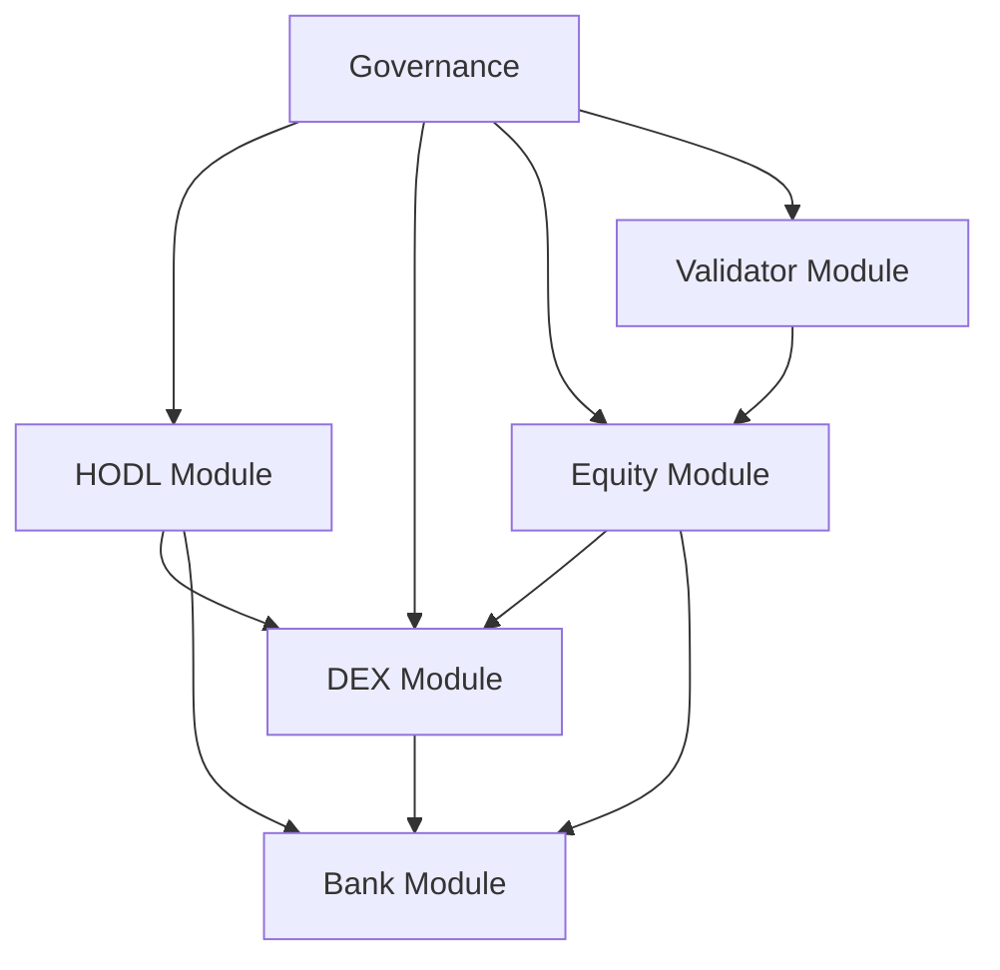

# ShareHODL Module Documentation

## Overview

ShareHODL consists of five custom modules built on the Cosmos SDK framework. Each module handles specific functionality for the decentralized equity trading platform.

## Module Architecture

```
┌─────────────────────────────────────────────────┐
│                ShareHODL Modules                │
├─────────────┬─────────────┬─────────────────────┤
│    HODL     │     DEX     │       Equity        │
│ Stablecoin  │   Trading   │    Tokenization     │
├─────────────┼─────────────┼─────────────────────┤
│  Validator  │   Governance (Standard SDK)      │
│    Tiers    │   Module Enhancement              │
└─────────────┴─────────────┴─────────────────────┘
```

## 1. HODL Module (`x/hodl`)

### Purpose
USD-pegged stablecoin providing price stability and low transaction fees for the ShareHODL ecosystem.

### Core Features
- **Collateral-Backed Minting**: 150% over-collateralization requirement
- **Automatic Liquidation**: Triggered at 130% collateral ratio
- **Stability Fees**: 0.05% annual fee to maintain peg
- **Minting/Burning Fees**: 0.01% fee for minting and burning operations

### Key Types

```go
// Parameters for HODL module
type Params struct {
    MintingEnabled   bool           `json:"minting_enabled"`
    CollateralRatio  math.LegacyDec `json:"collateral_ratio"`
    StabilityFee     math.LegacyDec `json:"stability_fee"`
    LiquidationRatio math.LegacyDec `json:"liquidation_ratio"`
    MintFee         math.LegacyDec `json:"mint_fee"`
    BurnFee         math.LegacyDec `json:"burn_fee"`
}

// Collateral position for each user
type CollateralPosition struct {
    Owner         string         `json:"owner"`
    Collateral    sdk.Coins      `json:"collateral"`
    MintedHODL    math.Int       `json:"minted_hodl"`
    StabilityDebt math.LegacyDec `json:"stability_debt"`
    LastUpdated   int64          `json:"last_updated"`
}
```

### Operations

#### Mint HODL
```go
func (k Keeper) MintHODL(ctx sdk.Context, msg *MsgMintHODL) error {
    // Validate collateral ratio
    ratio := k.CalculateCollateralRatio(msg.Collateral, msg.Amount)
    if ratio.LT(k.GetParams(ctx).CollateralRatio) {
        return ErrInsufficientCollateral
    }
    
    // Lock collateral and mint HODL
    return k.ExecuteMint(ctx, msg)
}
```

#### Liquidate Position
```go
func (k Keeper) LiquidatePosition(ctx sdk.Context, owner sdk.AccAddress) error {
    position := k.GetCollateralPosition(ctx, owner)
    ratio := k.CalculateCurrentRatio(ctx, position)
    
    if ratio.GTE(k.GetParams(ctx).LiquidationRatio) {
        return ErrPositionNotLiquidatable
    }
    
    return k.ExecuteLiquidation(ctx, position)
}
```

### State Management

**KV Store Keys**:
- `0x00`: Module parameters
- `0x01`: Total HODL supply
- `0x05{address}`: Individual collateral positions

**Default Parameters**:
```json
{
  "minting_enabled": true,
  "collateral_ratio": "1.500000000000000000",
  "stability_fee": "0.000500000000000000",
  "liquidation_ratio": "1.300000000000000000",
  "mint_fee": "0.000100000000000000",
  "burn_fee": "0.000100000000000000"
}
```

### Events

```go
// Emitted when HODL is minted
type EventMintHODL struct {
    Minter     string    `json:"minter"`
    Amount     math.Int  `json:"amount"`
    Collateral sdk.Coins `json:"collateral"`
    Fee        math.Int  `json:"fee"`
}

// Emitted when position is liquidated
type EventLiquidatePosition struct {
    Owner            string    `json:"owner"`
    CollateralSeized sdk.Coins `json:"collateral_seized"`
    DebtRepaid       math.Int  `json:"debt_repaid"`
}
```

---

## 2. DEX Module (`x/dex`)

### Purpose
High-performance decentralized exchange enabling atomic swaps between equity tokens and HODL stablecoin.

### Core Features
- **Order Book Trading**: Traditional limit and market orders
- **Atomic Swaps**: Cross-asset trades with guaranteed execution
- **Slippage Protection**: Maximum 50% slippage limit
- **Trading Fees**: 0.3% fee split between validators and treasury

### Key Types

```go
// Trading parameters
type Params struct {
    TradingFee    math.LegacyDec `json:"trading_fee"`
    MaxSlippage   math.LegacyDec `json:"max_slippage"`
    OrderTimeout  time.Duration  `json:"order_timeout"`
}

// Market configuration
type Market struct {
    BaseDenom   string         `json:"base_denom"`
    QuoteDenom  string         `json:"quote_denom"`
    TickSize    math.LegacyDec `json:"tick_size"`
    MinQuantity math.Int       `json:"min_quantity"`
}

// Trading order
type Order struct {
    ID           uint64         `json:"id"`
    Creator      string         `json:"creator"`
    Market       string         `json:"market"`
    Side         OrderSide      `json:"side"`
    Quantity     math.Int       `json:"quantity"`
    Price        math.LegacyDec `json:"price"`
    Filled       math.Int       `json:"filled"`
    Status       OrderStatus    `json:"status"`
    CreatedAt    int64          `json:"created_at"`
    ExpiresAt    int64          `json:"expires_at"`
}
```

### Trading Operations

#### Create Order
```go
func (k Keeper) CreateOrder(ctx sdk.Context, msg *MsgCreateOrder) error {
    // Validate market exists
    if !k.IsValidMarket(ctx, msg.BaseDenom, msg.QuoteDenom) {
        return ErrInvalidMarket
    }
    
    // Lock required funds
    if err := k.LockOrderFunds(ctx, msg); err != nil {
        return err
    }
    
    // Add to order book
    orderID := k.GetNextOrderID(ctx)
    order := NewOrder(orderID, msg)
    k.SetOrder(ctx, order)
    
    // Attempt immediate matching
    return k.MatchOrder(ctx, order)
}
```

#### Execute Trade
```go
func (k Keeper) ExecuteTrade(ctx sdk.Context, buyOrder, sellOrder Order, quantity math.Int, price math.LegacyDec) error {
    // Calculate trade amounts
    baseAmount := quantity
    quoteAmount := quantity.Mul(price.TruncateInt())
    
    // Calculate fees
    fee := k.CalculateTradingFee(ctx, quoteAmount)
    
    // Execute atomic swap
    if err := k.SwapAssets(ctx, buyOrder.Creator, sellOrder.Creator, baseAmount, quoteAmount.Sub(fee)); err != nil {
        return err
    }
    
    // Distribute fees
    return k.DistributeFees(ctx, fee)
}
```

### State Management

**KV Store Keys**:
- `0x00`: Module parameters
- `0x01`: Order counter
- `0x02{order_id}`: Individual orders
- `0x03`: Trade counter
- `0x04{trade_id}`: Trade history

### Order Matching Algorithm

```go
func (k Keeper) MatchOrder(ctx sdk.Context, newOrder Order) error {
    // Get opposite side orders sorted by price priority
    candidates := k.GetMatchingOrders(ctx, newOrder)
    
    remaining := newOrder.Quantity
    for _, candidate := range candidates {
        if remaining.IsZero() {
            break
        }
        
        // Check price compatibility
        if !k.IsPriceMatch(newOrder, candidate) {
            break
        }
        
        // Calculate trade quantity
        tradeQty := math.MinInt(remaining, candidate.Quantity.Sub(candidate.Filled))
        
        // Execute trade
        if err := k.ExecuteTrade(ctx, newOrder, candidate, tradeQty, candidate.Price); err != nil {
            return err
        }
        
        // Update order states
        remaining = remaining.Sub(tradeQty)
        k.UpdateOrderFilled(ctx, candidate.ID, candidate.Filled.Add(tradeQty))
    }
    
    // Add remaining quantity to order book
    if remaining.IsPositive() {
        k.AddToOrderBook(ctx, newOrder)
    }
    
    return nil
}
```

---

## 3. Equity Module (`x/equity`)

### Purpose
Tokenization and management of company shares with built-in compliance and verification features.

### Core Features
- **Company Registration**: On-chain business verification
- **Share Tokenization**: ERC-20-like equity tokens
- **Cap Table Management**: Real-time ownership tracking
- **Dividend Distribution**: Automated profit sharing

### Key Types

```go
// Company information
type Company struct {
    ID                  uint64    `json:"id"`
    Name                string    `json:"name"`
    Symbol              string    `json:"symbol"`
    RegistrationCountry string    `json:"registration_country"`
    BusinessType        string    `json:"business_type"`
    Verified            bool      `json:"verified"`
    VerifierTier        string    `json:"verifier_tier"`
    CreatedAt           int64     `json:"created_at"`
}

// Share class definition
type ShareClass struct {
    ID           string    `json:"id"`
    CompanyID    uint64    `json:"company_id"`
    Name         string    `json:"name"`
    Symbol       string    `json:"symbol"`
    TotalShares  math.Int  `json:"total_shares"`
    IssuedShares math.Int  `json:"issued_shares"`
    SharePrice   math.Int  `json:"share_price"`
    Currency     string    `json:"currency"`
}

// Individual shareholding
type Shareholding struct {
    Owner       string    `json:"owner"`
    CompanyID   uint64    `json:"company_id"`
    ShareClass  string    `json:"share_class"`
    Shares      math.Int  `json:"shares"`
    VestingInfo *Vesting  `json:"vesting_info,omitempty"`
}
```

### Business Operations

#### Register Company
```go
func (k Keeper) RegisterCompany(ctx sdk.Context, msg *MsgRegisterCompany) error {
    // Validate business information
    if err := k.ValidateBusinessInfo(ctx, msg); err != nil {
        return err
    }
    
    // Assign to validator for verification
    validator := k.AssignValidator(ctx, msg.ValuationEstimate)
    
    // Create company record
    companyID := k.GetNextCompanyID(ctx)
    company := NewCompany(companyID, msg)
    k.SetCompany(ctx, company)
    
    // Initiate verification process
    return k.StartVerification(ctx, company, validator)
}
```

#### Issue Shares
```go
func (k Keeper) IssueShares(ctx sdk.Context, msg *MsgIssueShares) error {
    // Verify company exists and is verified
    company := k.GetCompany(ctx, msg.CompanyID)
    if !company.Verified {
        return ErrCompanyNotVerified
    }
    
    // Validate share class
    shareClass := k.GetShareClass(ctx, msg.CompanyID, msg.ShareClass)
    if shareClass.IssuedShares.Add(msg.Amount).GT(shareClass.TotalShares) {
        return ErrExceedsAuthorizedShares
    }
    
    // Create share tokens
    return k.MintShares(ctx, msg.Recipient, msg.CompanyID, msg.ShareClass, msg.Amount)
}
```

### Verification System

```go
// Business verification tiers based on company size
type VerificationTier struct {
    Name           string    `json:"name"`
    MaxValuation   math.Int  `json:"max_valuation"`
    RequiredStake  math.Int  `json:"required_stake"`
    ValidatorTier  string    `json:"validator_tier"`
    EquityReward   math.LegacyDec `json:"equity_reward"`
}

var VerificationTiers = []VerificationTier{
    {
        Name:          "micro",
        MaxValuation:  math.NewInt(500_000_000_000),     // $500K in uusd
        RequiredStake: math.NewInt(50_000_000_000),      // 50K HODL
        ValidatorTier: "bronze",
        EquityReward:  math.LegacyNewDecWithPrec(8, 4),  // 0.08%
    },
    {
        Name:          "small",
        MaxValuation:  math.NewInt(2_000_000_000_000),   // $2M
        RequiredStake: math.NewInt(150_000_000_000),     // 150K HODL
        ValidatorTier: "silver",
        EquityReward:  math.LegacyNewDecWithPrec(10, 4), // 0.10%
    },
    // ... additional tiers
}
```

---

## 4. Validator Module (`x/validator`)

### Purpose
Enhanced validator system with tier-based rewards and business verification capabilities.

### Core Features
- **Tier System**: Bronze to Diamond validator levels
- **Business Verification**: Validators verify companies based on tier
- **Reward Multipliers**: Higher tiers earn increased block rewards
- **Reputation Tracking**: Performance-based validator scoring

### Key Types

```go
// Validator tier information
type ValidatorTierInfo struct {
    ValidatorAddress string         `json:"validator_address"`
    Tier            ValidatorTier  `json:"tier"`
    StakeAmount     math.Int       `json:"stake_amount"`
    RewardMultiplier math.LegacyDec `json:"reward_multiplier"`
    Verifications   uint64         `json:"verifications_completed"`
    ReputationScore math.LegacyDec `json:"reputation_score"`
}

// Validator tiers with requirements
type ValidatorTier struct {
    Name             string         `json:"name"`
    MinStake         math.Int       `json:"min_stake"`
    RewardMultiplier math.LegacyDec `json:"reward_multiplier"`
    MaxBusinessSize  math.Int       `json:"max_business_size"`
}
```

### Tier System

| Tier | Min Stake (HODL) | Reward Multiplier | Max Business Value | Verification Fee |
|------|------------------|-------------------|-------------------|------------------|
| Bronze | 10M | 1.0x | $500K | 0.08% equity |
| Silver | 100M | 1.2x | $2M | 0.10% equity |
| Gold | 1B | 1.5x | $20M | 0.12% equity |
| Platinum | 5B | 2.0x | $100M | 0.15% equity |
| Diamond | 10B | 3.0x | Unlimited | 0.20% equity |

### Tier Management

```go
func (k Keeper) UpdateValidatorTier(ctx sdk.Context, valAddr sdk.ValAddress) error {
    // Get current stake amount
    validator := k.stakingKeeper.GetValidator(ctx, valAddr)
    if !validator.Found() {
        return ErrValidatorNotFound
    }
    
    // Calculate new tier based on stake
    newTier := k.CalculateTier(ctx, validator.GetTokens())
    
    // Update tier information
    tierInfo := ValidatorTierInfo{
        ValidatorAddress: valAddr.String(),
        Tier:            newTier,
        StakeAmount:     validator.GetTokens(),
        RewardMultiplier: newTier.RewardMultiplier,
    }
    
    k.SetValidatorTierInfo(ctx, valAddr, tierInfo)
    return nil
}
```

### Business Verification

```go
func (k Keeper) AssignBusinessVerification(ctx sdk.Context, businessID uint64, valuation math.Int) (sdk.ValAddress, error) {
    // Get eligible validators for this business size
    requiredTier := k.GetRequiredTierForBusiness(ctx, valuation)
    eligibleValidators := k.GetValidatorsInTier(ctx, requiredTier)
    
    if len(eligibleValidators) == 0 {
        return nil, ErrNoEligibleValidators
    }
    
    // Select validator with lowest current workload
    selectedValidator := k.SelectValidatorByWorkload(ctx, eligibleValidators)
    
    // Create verification assignment
    verification := BusinessVerification{
        BusinessID:       businessID,
        ValidatorAddress: selectedValidator,
        AssignedAt:      ctx.BlockTime(),
        Status:          VerificationPending,
    }
    
    k.SetBusinessVerification(ctx, verification)
    return selectedValidator, nil
}
```

---

## 5. Governance Integration

### Enhanced Governance Features
- **Parameter Updates**: On-chain parameter modification
- **Validator Tier Adjustments**: Community-driven tier requirement changes
- **Emergency Procedures**: Circuit breakers and emergency stops

### Custom Proposal Types

```go
// Proposal to update HODL module parameters
type ParameterChangeProposal struct {
    Title       string `json:"title"`
    Description string `json:"description"`
    Module      string `json:"module"`
    Key         string `json:"parameter_key"`
    Value       string `json:"new_value"`
}

// Proposal to add new trading pairs
type AddMarketProposal struct {
    Title       string `json:"title"`
    Description string `json:"description"`
    BaseDenom   string `json:"base_denom"`
    QuoteDenom  string `json:"quote_denom"`
    TickSize    string `json:"tick_size"`
    MinQuantity string `json:"min_quantity"`
}
```

## Module Integration

### Cross-Module Dependencies



### Event Flow
1. **Business Registration**: Equity → Validator (verification assignment)
2. **Share Trading**: Equity → DEX (market creation)
3. **Fee Payment**: DEX → HODL (gas fee conversion)
4. **Validator Rewards**: Validator → HODL (reward distribution)

## Testing and Validation

### Unit Tests
- Individual module functionality
- Parameter validation
- State consistency checks
- Error handling verification

### Integration Tests
- Cross-module interactions
- End-to-end user workflows
- Performance benchmarks
- Stress testing scenarios

### Security Considerations
- Access control validation
- Economic attack vectors
- State corruption prevention
- Upgrade safety mechanisms

---

This module documentation provides comprehensive coverage of ShareHODL's custom blockchain modules and their interactions within the ecosystem.