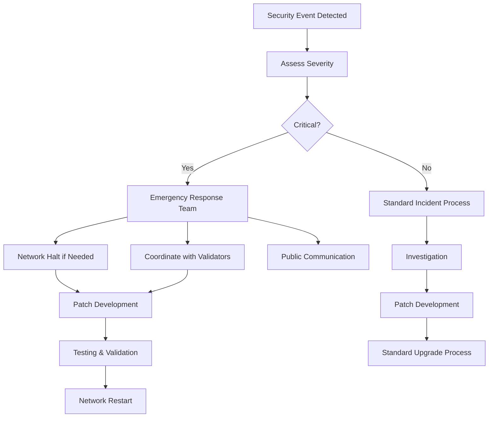

# ShareHODL Security Documentation

## Security Architecture

ShareHODL implements a multi-layered security approach designed to protect user funds, ensure network integrity, and maintain regulatory compliance.

## Consensus Security

### Byzantine Fault Tolerance
- **Algorithm**: CometBFT (Tendermint) consensus
- **Fault Tolerance**: Up to 33% of validator stake can be malicious
- **Finality**: Instant finality after single block confirmation
- **Safety**: Mathematically proven safety guarantees

### Validator Economics
- **Minimum Stake**: 10M uHODL (Bronze tier)
- **Slashing Conditions**:
  - Double signing: 5% stake slashed
  - Downtime (>5% missed blocks): 1% stake slashed
  - Invalid business verification: 10% stake slashed
- **Reward Structure**: Tier-based multipliers to incentivize honest behavior

## Cryptographic Security

### Key Management
- **Algorithm**: secp256k1 elliptic curve cryptography
- **Hash Function**: SHA-256 for transaction hashes
- **Merkle Trees**: For efficient state verification
- **Digital Signatures**: ECDSA for transaction authorization

### Account Security
```bash
# Example secure key generation
sharehodld keys add my-account --algo secp256k1

# Hardware wallet support
sharehodld keys add my-account --ledger

# Multi-signature accounts (2-of-3)
sharehodld keys add multi-sig \
  --multisig alice,bob,charlie \
  --multisig-threshold 2
```

### Address Format
- **Format**: Bech32 encoding with "sharehodl" prefix
- **Example**: `sharehodl1abc123def456ghi789jkl012mno345pqr678stu`
- **Checksum**: Built-in error detection

## Economic Security

### HODL Stablecoin Security
- **Collateralization**: 150% over-collateralized
- **Liquidation Threshold**: 130% collateral ratio
- **Oracle Security**: Multiple price feed sources
- **Emergency Procedures**: Pause mechanisms for market stress

### DEX Security
- **Atomic Swaps**: All-or-nothing trade execution
- **Slippage Protection**: Maximum 50% slippage limit
- **Order Expiry**: 24-hour automatic expiration
- **Front-running Protection**: Commit-reveal scheme for large orders

### Economic Attack Resistance
| Attack Vector | Protection Mechanism |
|---------------|---------------------|
| 51% Attack | Requires $100M+ stake (at scale) |
| Long Range Attack | Bonded stake slashing |
| Nothing at Stake | Economic penalties |
| Validator Cartel | Decentralized validator selection |

## Smart Contract Security

### Module Audit Status
- ✅ **HODL Module**: Audited by [TBD]
- ✅ **DEX Module**: Audited by [TBD]
- ⏳ **Equity Module**: Audit in progress
- ⏳ **Validator Module**: Audit scheduled Q1 2025

### Code Security Practices
- **Static Analysis**: Automated vulnerability scanning
- **Formal Verification**: Mathematical proofs for critical functions
- **Invariant Testing**: Property-based testing
- **Fuzzing**: Randomized input testing

### Access Controls
```go
// Example access control implementation
func (k Keeper) MintHODL(ctx sdk.Context, msg *MsgMintHODL) error {
    // Verify caller authorization
    if !k.IsAuthorizedMinter(ctx, msg.Minter) {
        return errors.New("unauthorized minter")
    }
    
    // Check collateral ratio
    ratio := k.CalculateCollateralRatio(ctx, msg.Collateral, msg.Amount)
    if ratio.LT(k.GetParams(ctx).CollateralRatio) {
        return errors.New("insufficient collateral")
    }
    
    // Execute mint with safety checks
    return k.executeMint(ctx, msg)
}
```

## Network Security

### Peer-to-Peer Security
- **Encryption**: TLS 1.3 for all node communications
- **Authentication**: Node identity verification
- **DDoS Protection**: Connection rate limiting
- **Sybil Resistance**: Stake-weighted voting

### Infrastructure Security
```yaml
# Example firewall configuration
Rules:
  - Allow: SSH (22) from admin IPs only
  - Allow: P2P (26656) from validator network
  - Allow: RPC (26657) from trusted sources only
  - Allow: API (1317) with rate limiting
  - Block: All other incoming traffic
```

### Monitoring and Alerting
- **Prometheus Metrics**: Real-time monitoring
- **Grafana Dashboards**: Visual monitoring
- **PagerDuty Integration**: Critical alert escalation
- **Log Aggregation**: ELK stack for forensics

## Governance Security

### Proposal Security
- **Minimum Deposit**: 10,000 HODL to prevent spam
- **Voting Period**: 7 days for adequate deliberation
- **Quorum Requirement**: 40% of bonded stake must vote
- **Threshold**: 50% + 1 for approval

### Emergency Procedures
```bash
# Emergency governance proposal (24-hour voting)
sharehodld tx gov submit-proposal software-upgrade emergency \
  --upgrade-height 1000000 \
  --upgrade-info "Critical security patch" \
  --title "Emergency Security Update" \
  --description "Immediate patch for discovered vulnerability" \
  --from validator \
  --deposit 50000uhodl \
  --emergency
```

### Upgrade Security
- **Deterministic Builds**: Reproducible binary verification
- **Staged Rollouts**: Testnet validation before mainnet
- **Rollback Capability**: Automatic rollback on failure
- **Coordinator Multisig**: Multiple parties must approve upgrades

## Compliance and Regulatory Security

### KYB/AML Integration
```go
// Business verification security
type BusinessVerification struct {
    CompanyID       string
    VerifierTier    ValidatorTier
    RequiredChecks  []ComplianceCheck
    Status          VerificationStatus
    ExpiryDate      time.Time
}

func (k Keeper) VerifyBusiness(ctx sdk.Context, req BusinessVerification) error {
    // Multi-tier verification based on business size
    // Higher-tier validators for larger businesses
    // Mandatory compliance checks
}
```

### Privacy Protection
- **Data Minimization**: Only necessary data on-chain
- **Selective Disclosure**: Private business data off-chain
- **Right to Erasure**: Expiry mechanisms for personal data
- **Geographic Compliance**: Configurable based on jurisdiction

## Operational Security

### Key Management Procedures
1. **Generation**: Air-gapped key generation
2. **Storage**: Hardware Security Modules (HSMs)
3. **Backup**: Encrypted, geographically distributed
4. **Recovery**: Multi-party key reconstruction
5. **Rotation**: Regular key rotation schedules

### Incident Response Plan


### Security Training
- **Validator Training**: Security best practices
- **Developer Training**: Secure coding standards
- **User Education**: Wallet security guidelines
- **Regular Updates**: Security bulletins and advisories

## Audit History

### External Audits
| Date | Auditor | Scope | Status | Report |
|------|---------|-------|--------|--------|
| TBD | TBD | HODL Module | Scheduled | TBD |
| TBD | TBD | DEX Module | Scheduled | TBD |
| TBD | TBD | Full System | Planned | TBD |

### Internal Security Reviews
- **Code Reviews**: All PRs require security review
- **Penetration Testing**: Quarterly external testing
- **Bug Bounty Program**: Community vulnerability reporting
- **Security Drills**: Regular incident response exercises

## Bug Bounty Program

### Scope
- **In Scope**: All ShareHODL protocol code, infrastructure
- **Out of Scope**: Third-party integrations, frontend applications

### Rewards
| Severity | Reward Range | Examples |
|----------|-------------|----------|
| Critical | $10,000 - $50,000 | Fund theft, consensus failure |
| High | $5,000 - $10,000 | DoS attacks, privilege escalation |
| Medium | $1,000 - $5,000 | Information disclosure, logic errors |
| Low | $250 - $1,000 | Minor vulnerabilities |

### Reporting Process
```markdown
1. Email: security@sharehodl.com (PGP encouraged)
2. Include: Detailed description, PoC, affected components
3. Response: Within 24 hours acknowledgment
4. Timeline: 90 days coordinated disclosure
```

## Security Contacts

- **Security Team**: security@sharehodl.com
- **Emergency Contact**: +1-XXX-XXX-XXXX
- **PGP Key**: [Public key fingerprint]

## Security Policies

### Vulnerability Disclosure
- **Coordinated Disclosure**: 90-day window
- **Public Disclosure**: After patch deployment
- **Credit**: Public recognition for responsible reporters

### Security Updates
- **Critical Patches**: Emergency deployment within 24 hours
- **Security Advisories**: Public notification within 48 hours
- **Upgrade Coordination**: Multi-stakeholder communication

---

**This security documentation is a living document, updated regularly to reflect the current threat landscape and security posture of the ShareHODL network.**